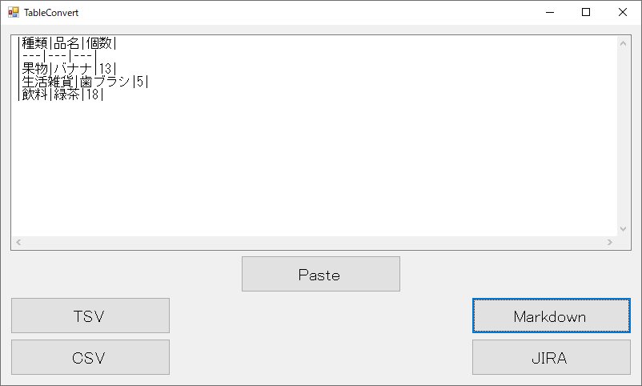

# TableConvert
CSV/TSVのテーブルと Markdown 形式のテーブルを変換します。  
MySQL のコマンドラインクライアント等で出力される `+` `-` `|` 記号を使った格子形式 (入力のみ)、  
Atlassian の JIRA で利用されている表の形式にも対応しています。

## 利用方法

- テキスト ボックス
    - 表のソースとなるテキストを入力します。CSV、TSV、格子形式(後述)、Markdown、Atlassian JIRA の書式が利用できます。
- Paste
    - 現在のクリップボードに記録されているテキストをテキスト ボックスに貼り付けます。  
      テキスト ボックスに入力されているテキストは変更されるので、ご注意下さい。
- TSV
    - テキスト ボックスに入力されたテーブル情報を、TSV (Tab-Separated Values) 形式でクリップボードに記録します。  
      Excel 等にそのまま表形式で貼り付ける事ができますが、  
      書式情報は含まないため Excel のセルの書式は貼り付け先の設定に変換される事があります (日付/時刻形式等)。  
      Excel に正確に貼り付けるには、テキスト ファイル ウィザードによりタブ区切りで貼り付ける等の方法があります。
- CSV
    - テキスト ボックスに入力されたテーブル情報を、CSV (Comma-Separated Values) 形式でクリップボードに記録します。
- Markdown
    - テキスト ボックスに入力されたテーブル情報を、Markdown の表形式でクリップボードに記録します。
- JIRA
    - テキスト ボックスに入力されたテーブル情報を、Atlassian JIRA の表形式でクリップボードに記録します。

## 形式について
以下のようなテーブルを扱う場合を説明します。

|種類|品名|単価|個数|
|---|---|---|---|
|果物|バナナ|80|13|
|生活雑貨|歯ブラシ|100|5|
|飲料|緑茶|200|18|

### CSV
- 入力/出力
    - 以下のような形式を受け付け、出力します。
    ```
    種類,品名,単価,個数
    果物,バナナ,80,13
    生活雑貨,歯ブラシ,100,5
    飲料,緑茶,200,18
    ```
    列前後の空白のトリムは行いません。  
    `,`を含む列を扱う場合は、`"`で囲みます。
    ```
    "分類,1","分類,2",品名,単価,個数
    ```

### TSV
- 入力/出力
    - 以下のような形式を受け付け、出力します。
    ```
    種類	品名	単価	個数
    果物	バナナ	80	13
    生活雑貨	歯ブラシ	100	5
    飲料	緑茶	200	18
    ```
    列前後の空白のトリムは行いません。  
    タブを含む列を扱う場合は、`"`で囲みます。
    ```
    "分類	1"	"分類	2"	品名	単価	個数
    ```

### Markdown
- 入力
    - 以下のような形式を受け付けます。  
    ```
    |種類|品名|単価|個数|
    |:---:|:---|---:|---|
    |果物|バナナ|80|13|
    |飲料|緑茶|200|18|
    ```  
    コロンで指定された左寄せ/中央寄せ/右寄せ等の書式は無視されます。
- 出力
    - 以下のような形式を出力します。  
    ```
    |種類|品名|単価|個数|
    |---|---|---|---|
    |果物|バナナ|80|13|
    |生活雑貨|歯ブラシ|100|5|
    |飲料|緑茶|200|18|
    ```
- エスケープ文字
    - 以下をエスケープ文字として扱います。入力でエスケープされている場合はエスケープされた文字として扱い、  
      出力値に含まれる場合はプレフィクス `\` を付与します。  
      `_` `-` `!` `.` `(` `)` `[` `]` `{` `}` `*` `\` `#` `` ` `` `+` `|`

### Atlassian JIRA
- 入力
    - 以下のような形式を受け付けます。  
    ```
    ||種類||品名||単価||個数||
    |果物|バナナ|80|13|
    |生活雑貨|歯ブラシ|100|5|
    |飲料|緑茶|200|18|
    ```  
    ```
    |種類|品名|単価|個数|
    |果物|バナナ|80|13|
    |生活雑貨|歯ブラシ|100|5|
    |飲料|緑茶|200|18|
    ```  
- 出力
    - 以下のような形式を出力します。  
    ```
    ||種類||品名||単価||個数||
    |果物|バナナ|80|13|
    |生活雑貨|歯ブラシ|100|5|
    |飲料|緑茶|200|18|
    ```

- エスケープ文字
    - 以下をエスケープ文字として扱います。入力でエスケープされている場合はエスケープされた文字として扱い、  
      出力値に含まれる場合はプレフィクス `\` を付与します。  
      `_` `-` `:` `?` `.` `(` `)` `{` `}` `*` `\` `#` `^` `+` `~` `|`

### 格子形式
- 入力
    - 以下のような形式を受け付けます。  
    ```
    +----------+----------+------+------+
    | 種類     | 品名     | 単価 | 個数 |
    +----------+----------+------+------+
    | 果物     | バナナ   |   80 |   13 |
    | 生活雑貨 | 歯ブラシ |  100 |    5 |
    | 飲料     | 緑茶     |  200 |   18 |
    +----------+----------+------+------+
    ```
    前後の空白はトリムされます。
